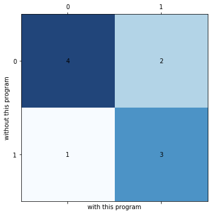

# ISblastx_DFAST.py
**DFASTが出力するデータを継承して、CDS間領域をblastxするスクリプト**
## Usage
```
$ python3 ISblastx_DFAST.py -g genome_sample.fasta -f featues_sample.tsv
```
## 入出力と依存
- 入力データ
  - DFASTが出力したgenome.fasta.(contig IDが'sequence~'の形で統一されているもの)
  - DFASTが出力したfeatures.tsv.(CDSの開始点と終了点およびそのCDSが抽出されたcontig IDを使用)
- 出力データ
  - CDS間領域の塩基配列データ(-> interval_regions.fasta)
  - CDS間領域のblastxの結果
- 依存
  - python 3.7
  - biopython 1.77

## 性能の評価
`２つの作業、つまりCDSの開始点と終了点の精査、およびCDS間領域における新CDSの探索について、t吉岡氏がマニュアルで行なった結果と本スクリプトを使用して行なった結果の比較を行なった`  
- CDS領域の開始点と終了点を精査する作業について
  - 正解率(accuracy) : %  
  - 適合率(precision) : %  
  - 再現率(recall) : %  
  - F1スコア : %  
  - 混合行列↓  

(0, 1) = (変更なし, CDS領域を変更)  
``コメント``  

- CDS間領域における新CDSの探索について
  - 正解率(accuracy) : %  
  - 適合率(precision) : %  
  - 再現率(recall) : %  
  - F1スコア : %  
  - 混合行列↓  

(0, 1) = (変更なし, 新CDSを発見)

``コメント``  

``実用可能かどうかについて言及する``

## optional arguments
```
  -h, --help            show this help message and exit
  -g GENOME             path to genome.fasta from DFAST. The contig ID is
                        unified in the form of "sequence~"
  -f FEATURES, --features FEATURES
                        path to features.tsv from DFAST
  -e EVALUE, --evalue EVALUE
                        evalue in blastx.(default:0.0001)
  -th THRESHOLD, --threshold THRESHOLD
                        minimum length of IS sequence as input of
                        blastx.(default:50)
  -db DATABASE, --database DATABASE
                        path to your nr database.(default:/home_ssd/local/db/b
                        lastdb.20200904/nr)
  -t NUM_THREADS, --num_threads NUM_THREADS
                        num_threads in blastx.(default:16)
  -nd NUM_DESCRIPTIONS, --num_descriptions NUM_DESCRIPTIONS
                        num_descriptions in blastx.(default:50)
  --Without_blast {True,False}
                        If "True", blastx will not be executed.(default:False)
```

## 補足事項
- CDS間領域が数十kbpほど抽出されていない可能性があるため、原因が分かり次第プログラムを修正する予定である。


