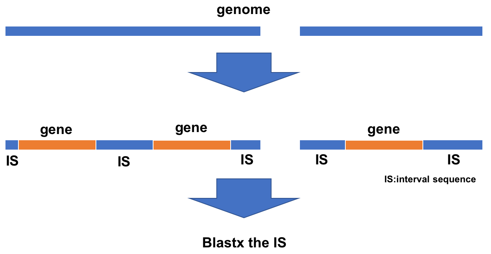
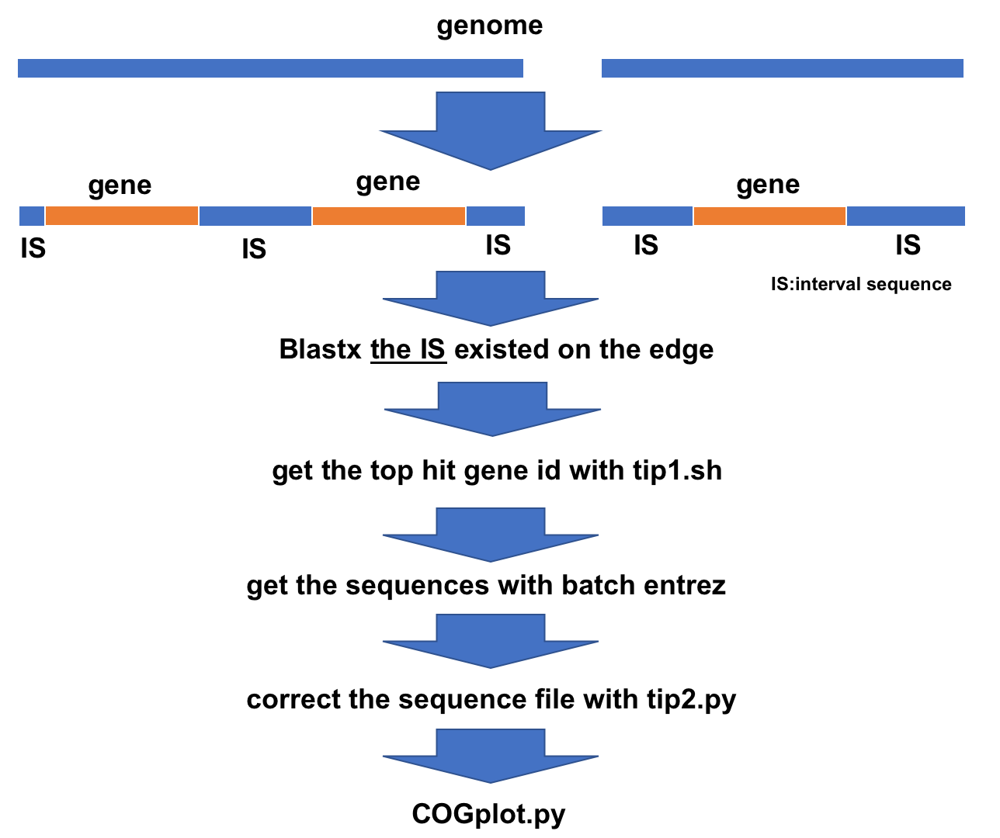

# blastxis



## dependency
- [DFAST](https://dfast.ddbj.nig.ac.jp "DFAST Home")
- [blastx](https://blast.ncbi.nlm.nih.gov/Blast.cgi?PROGRAM=blastx&PAGE_TYPE=BlastSearch&BLAST_SPEC=&LINK_LOC=blasttab&LAST_PAGE=blastp)
## Installation
```
$ git clone https://github.com/dkato2021/blastxis.git
$ chmod u+x blastxis.py
```
## Usage
```
$ blastxis.py -g genome.fna

#if you will omit DFAST
$ blastxis.py -g genome.fna -f featues.tsv
```

## optional arguments
```
optional arguments:
  -h, --help            show this help message and exit
  -g GENOME             path to your genome.fasta. If you will omit DFAST, the
                        contig ID is unified in the form of "sequence~"
  -f FEATURES           path to your features.tsv from DFAST.
  -e EVALUE, --evalue EVALUE
                        evalue in blastx.(default:0.001)
  -th THRESHOLD, --threshold THRESHOLD
                        minimum length of interval sequence as input of
                        blastx.(default:0)
  -db DATABASE, --database DATABASE
                        path to your nr database.(default:/home_ssd/local/db/blastdb.20200904/nr)
  -t NUM_THREADS, --num_threads NUM_THREADS
                        num threads in blastx.(default:48)
  -cpu NUM_THREADS_DFAST, --num_threads_dfast NUM_THREADS_DFAST
                        num threads in dfast.(default:48)
  -nd NUM_DESCRIPTIONS, --num_descriptions NUM_DESCRIPTIONS
                        num descriptions in blastx.(default:50)
  -x {True,False}       If "True", blastx will not be executed.(default:False)
```

## contig-edge analysis with this script

