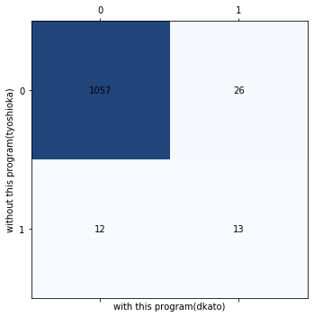

# ISblastx_DFAST.py
**[DFAST](https://dfast.ddbj.nig.ac.jp "DFAST Home")が出力するデータを継承して遺伝子間領域をblastxするスクリプト**
- blastxする際のevalueは0.0001をデフォルトにしています。
- 遺伝子間領域が1塩基であっても全てblastxします。（変更可能）
- DFASTのCLIを組み込めばゲノムを入力データにしたISblastxにできる
```
dfast --genome your_genome.fna
```
## Usage
```
$ python3 ISblastx_DFAST.py -g genome.fna -f featues.tsv
```
## 入出力と依存
- 入力データ
  - DFASTが出力したgenome.fasta. (contig IDが'sequence~'の形で統一されているもの)
  - DFASTが出力したfeatures.tsv. (遺伝子の開始点と終了点とその遺伝子をコードするcontig IDを使用)  
- 出力データ
  - 遺伝子間領域の塩基配列データ (-> interval_regions.fasta)
  - 遺伝子間領域のblastxの結果　　
- 依存
  - python 3.7

## 性能の評価
`遺伝子の開始点と終了点の精査、遺伝子間領域における新遺伝子の探索について、吉岡君がマニュアルで行なった結果と本スクリプトを使用して行なった結果を比較した`  

- 遺伝子領域の開始点と終了点を精査する作業について
  - 正解率(accuracy) : 93.77%  
  - 適合率(precision) : 48.89%  
  - 再現率(recall) : 32.35%  
  - F1スコア : 38.94%  
  - 混合行列↓  

(0, 1) = (変更なし, 遺伝子領域を変更)  

  ``comment=> ``  

- 遺伝子間領域における新遺伝子の探索について
  - 正解率(accuracy) : 96.57%  
  - 適合率(precision) : 33.3%  
  - 再現率(recall) : 52.00%  
  - F1スコア : 40.63%  
  - 混合行列↓  

(0, 1) = (変更なし, 新遺伝子を発見)  

  ``comment=> ``  

## optional arguments
```
  -h, --help            show this help message and exit
  -g GENOME             path to genome.fasta from DFAST. The contig ID is unified in the form of "sequence~"
  -f FEATURES           path to features.tsv from DFAST
  -e EVALUE, --evalue EVALUE
                        evalue in blastx.(default:0.0001)
  -th THRESHOLD, --threshold THRESHOLD
                        minimum length of interval sequence as input of blastx.(default:0)
  -db DATABASE, --database DATABASE
                        path to your nr database.(default:/home_ssd/local/db/blastdb.20200904/nr)
  -t NUM_THREADS, --num_threads NUM_THREADS
                        num threads in blastx.(default:16)
  -nd NUM_DESCRIPTIONS, --num_descriptions NUM_DESCRIPTIONS
                        num descriptions in blastx.(default:50)
  -x {True,False}       If "True", blastx will not be executed.(default:False)
```
## 注意
遺伝子間領域が数kbpほど抽出できていない可能性あり

